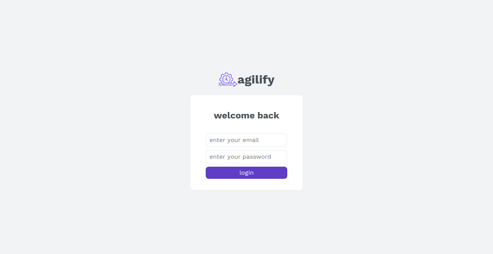
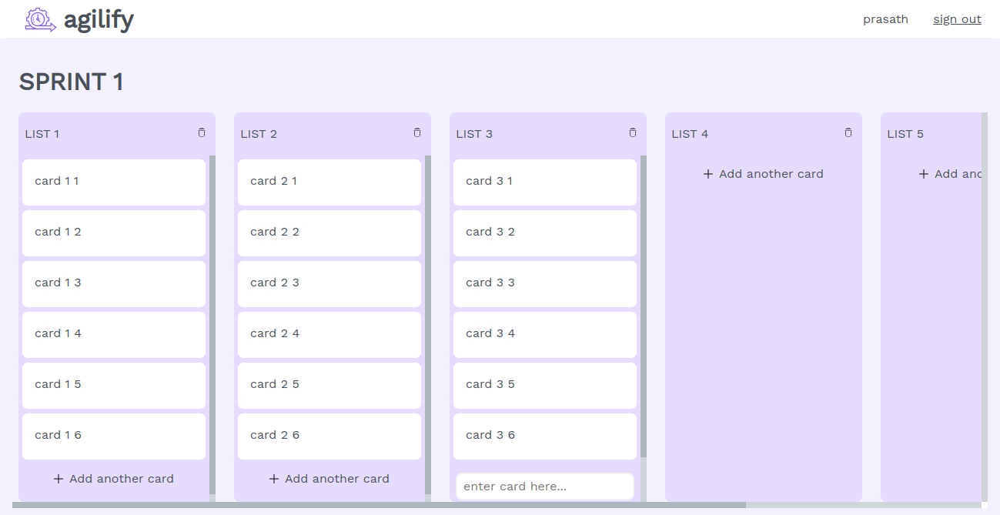

## Sprint board

Agilify is simple agile dashboard to monitor our stories [Agilify](https://jpelaa.github.io/agileboard.github.io/).
Project name: Agilify
Description: This is a tool designed and developed to enable an Agile team to manage the task at every step. The Tool provides different types of logins for members.

Frameworks used: React JS
Libraries used: redux (I considered redux as backend)
Features implemented :
Drag and Drop HTML.
CRUD for lists and cards.

---

Login Credentials:

Team members :
Member 1
Username: prasath
Password: 123
Member 2
Username: manoj
Password: 123
Member 3:
Username: karthick
Password: 123

### Login

### Sprint Board

